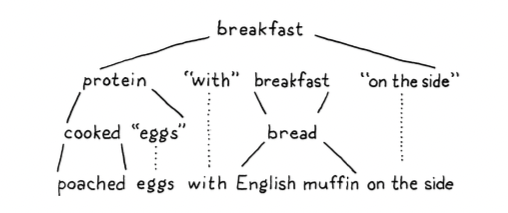

# Chapter 5: Representing Code

## Rules 

### Example of grammar for breakfast

Using that, here’s a grammar for breakfast menus:

```bnf

breakfast → protein "with" breakfast "on the side" ; 
breakfast → protein ;
breakfast → bread ;

protein → crispiness "crispy" "bacon" ;
protein  → "sausage";
protein → cooked "eggs" ;

crispiness → "really" ; 
crispiness → "really" crispiness ;

cooked → "scrambled" ;
cooked → "poached" ;
cooked → "fried" ;

bread → "toast" ;
bread → "biscuits" ;
bread → "English muffin";
```

Simplified notation
```bnf
breakfast → protein ( "with" breakfast "on the side" )? | bread ;
protein → "really"+ "crispy" "bacon" | "sausage"
| ( "scrambled" | "poached" | "fried" ) "eggs" ; 
bread → "toast" | "biscuits" | "English muffin" ;
```

Example



### Grammar for subset of Lox

```bnf
expression -> literal | unary | binary | grouping ;
literal -> NUMBER | STRING | "true" | "false" | "nil";
grouping -> "(" expression ")";
unary -> ("-", "!") expression;
binary -> expression operator expression;
operator -> "==", "!=", "<", "<=", ">", ">=", "+", "-", "*", "/";
```


## Challenges

### C.1

Earlier, I said that the |, *, and + forms we added to our grammar metasyntax 
were just syntactic sugar. Given this grammar:

```
bnf
expr → expr ( "(" ( expr ( "," expr )* )? ")" | "." IDENTIFIER )+ | IDENTIFIER | NUMBER
```

Produce a grammar that matches the same language but does not use any of that
notational sugar.

Bonus: What kind of expression does this bit of grammar encode?

### C.1 Solution

```
expr → expr calls
expr → IDENTIFIER
expr → NUMBER

calls → calls call
calls → call

call → "(" ")"
call → "(" arguments ")"
call → "." IDENTIFIER

arguments → expr
arguments → arguments "," expr
```
